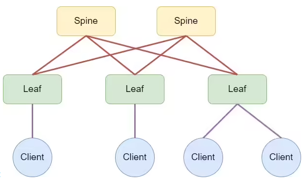
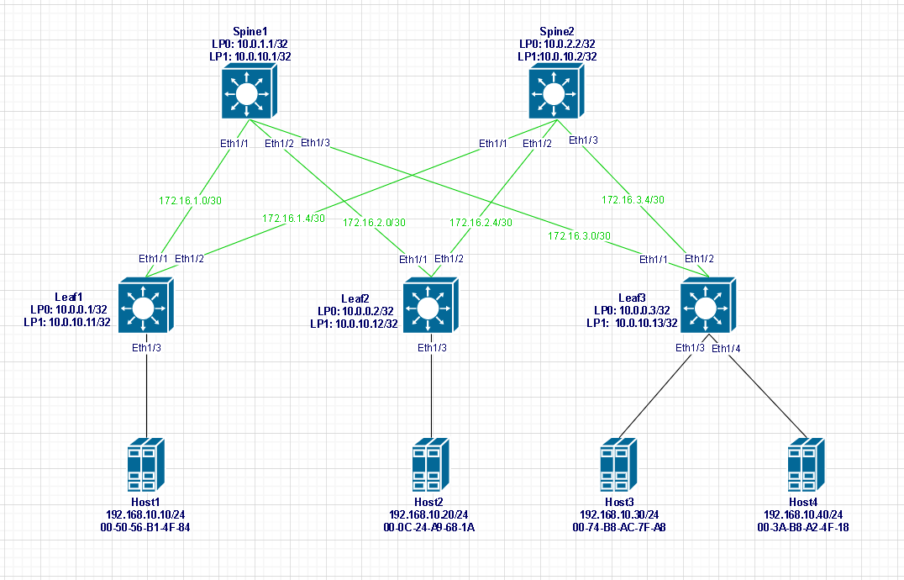

## 1. Собрать топологию CLOS, как на схеме:

 Теория 

Cети Клоза (Clos fabric), известное также как:
- Архитектура Leaf-Spine
- Folded Clos
- 3-stage
- Fat tree

*Leaf или T0 или ToR (Top of Rack) - первый уровень, сюда подключаются cерверные мощности, оконечное оборудование. 
Уровень Leaf- основной мозг фабрики, основа вычислительной мощности, оснеовные сложные протоколы живут тут.

Spine T1 ToP (Top of Pad) - второй уровень, сюда подключаются Leaf-коммутаторы (каждый Leaf подкл-ся к каждому Spine-у).
На данном уровне "мозгов" практически нет, основная задача это молотилка трафика.
Передать пакет с одного Leaf на другой максимально быстро*.

## 2. Адресное пространство для Underlay сети:

#### Адреса loppback-интерфейсов:
|  Наименование |  Адрес   |
| :------------ |:--------:|
| Spine1        | 10.0.1.1 |
| Spine2        | 10.0.2.2 |
| Leaf1         | 10.0.0.1 |
| Leaf2         | 10.0.0.2 |
| Leaf3         | 10.0.0.3 |

#### Линковочные сети:
| Наименование | IP Address |   Subnet Mask   | Default Gateway |
| :----------- |:----------:|  :-----------:  | :-------------: |
| Spine1_Leaf1 | 172.16.1.0 | 255.255.255.252 |  172.16.1.1     |
| Spine1_Leaf2 | 172.16.2.0 | 255.255.255.252 |  172.16.2.1     |
| Spine1_Leaf3 | 172.16.3.0 | 255.255.255.252 |  172.16.3.1     |
| Spine2_Leaf1 | 172.16.1.4 | 255.255.255.252 |  172.16.1.5     |
| Spine2_Leaf2 | 172.16.2.4 | 255.255.255.252 |  172.16.2.5     |
| Spine2_Leaf3 | 172.16.3.4 | 255.255.255.252 |  172.16.3.5     |

#### Адреса хостов:
|Наименование |  Адрес           |
| :---------- |:----------------:|
| Host1       | 192.168.10.10/24 |
| Host2       | 192.168.10.20/24 |
| Host3       | 192.168.10.30/24 |
| Host4       | 192.168.10.40/24 |

## 3. Структурная схема

